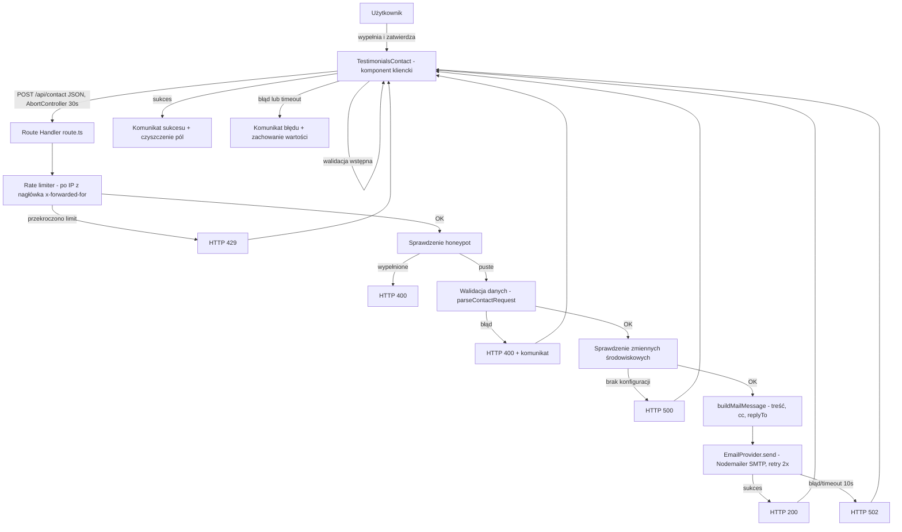

# Dokument projektowy

## Wprowadzenie / Przegląd (Overview)

Funkcja dodaje rzeczywistą wysyłkę wiadomości e-mail z formularza kontaktowego w komponencie `TestimonialsContact`. Obecnie formularz jedynie wyświetla `alert` i czyści pola. Nowe rozwiązanie składa się z dwóch warstw:

1. **Warstwa kliencka** (`TestimonialsContact.tsx`) — kontrolowany formularz React, który zbiera dane, wykonuje wstępną walidację, wysyła żądanie `POST` do trasy API z limitem czasu 30 sekund i prezentuje stany ładowania, sukcesu oraz błędu.
2. **Warstwa serwerowa** (Route Handler `src/app/api/contact/route.ts`) — odbiera żądanie `POST`, waliduje dane, sprawdza pole honeypot, stosuje ograniczanie liczby żądań po adresie IP, a następnie zleca wysyłkę wiadomości przez warstwę abstrakcji dostawcy poczty.

### Decyzje projektowe i uzasadnienie

**Weryfikacja zgodności z bieżącą wersją Next.js (zgodnie z AGENTS.md):** Projekt używa Next.js `16.2.9` (App Router) oraz React `19.2.4`. Przed zaprojektowaniem warstwy serwerowej przeczytano dokumentację dołączoną w `node_modules/next/dist/docs/`. Kluczowe ustalenia, które wpłynęły na projekt:

- **Route Handlers** definiuje się w pliku `route.ts` w katalogu `app` i eksportuje funkcje nazwane wg metod HTTP (`export async function POST(request: NextRequest)`). Źródło: `01-app/01-getting-started/15-route-handlers.md`.
- **`POST` nie jest cache'owany** domyślnie — nie trzeba dodatkowej konfiguracji, aby trasa działała dynamicznie. Źródło: tamże.
- **Deprecacja / zmiana łamiąca (KRYTYCZNE):** w Next.js v15 **usunięto `NextRequest.ip` oraz `NextRequest.geo`** (sekcja „Version History" w `04-functions/next-request.md`). Z tego powodu adres IP klienta do ograniczania liczby żądań **musi** być odczytywany z nagłówków (`x-forwarded-for`, ewentualnie `x-real-ip`), a nie z `request.ip`.
- **Runtime:** Nodemailer (SMTP) oraz licznik żądań w pamięci procesu wymagają środowiska Node.js. Trasa ustawi `export const runtime = 'nodejs'` (wartość domyślna, ustawiona jawnie dla czytelności). Źródło: `02-route-segment-config/runtime.md`.
- **Limity czasu wykonania:** `export const maxDuration` pozwala ustawić maksymalny czas wykonania logiki serwerowej (w sekundach), co wspiera platformy hostingowe w egzekwowaniu limitów. Źródło: `02-route-segment-config/maxDuration.md`.
- **Pakiety zewnętrzne Node:** zależności wymagające natywnych funkcji Node mogą wymagać wpisu w `serverExternalPackages` w `next.config.ts`. Nodemailer zostanie tam dodany dla bezpieczeństwa bundlowania. Źródło: `05-config/01-next-config-js/serverExternalPackages.md`.

**Mechanizm dostarczania poczty — Nodemailer przez SMTP (rekomendacja):**

Rozważono dwa podejścia:

- **Nodemailer (SMTP)** — biblioteka agnostyczna względem dostawcy, współpracuje z dowolnym serwerem SMTP (w tym serwerem poczty domeny `sukces-24.pl`). Natywnie obsługuje pola `cc` oraz `replyTo`, konfigurowalny timeout połączenia, działa w runtime Node.js.
- **Resend / usługa transakcyjna (HTTP API)** — prostsze SDK, ale wprowadza zależność od zewnętrznego dostawcy i wymaga weryfikacji domeny nadawcy.

**Wybór: Nodemailer przez SMTP.** Adres docelowy `kontakt@sukces-24.pl` wskazuje, że firma dysponuje własną domeną pocztową, więc konfiguracja SMTP jest naturalna i nie wiąże projektu z konkretnym dostawcą zewnętrznym. Logika wysyłki zostanie ukryta za interfejsem `EmailProvider`, dzięki czemu zmiana na Resend lub inną usługę w przyszłości nie wymaga modyfikacji warstwy walidacji ani trasy.

## Architektura (Architecture)



### Warstwy i odpowiedzialności

| Warstwa | Plik | Odpowiedzialność |
| --- | --- | --- |
| Komponent kliencki | `src/components/TestimonialsContact.tsx` | Kontrolowane pola, pole honeypot, walidacja wstępna, żądanie POST z limitem 30 s, stany UI |
| Route Handler | `src/app/api/contact/route.ts` | Orkiestracja: rate limiting → honeypot → walidacja → konfiguracja → wysyłka; mapowanie wyników na kody HTTP |
| Walidacja | `src/lib/contact/validation.ts` | Czysta funkcja `parseContactRequest` zwracająca wynik sukcesu lub listę błędów |
| Budowa wiadomości | `src/lib/contact/message.ts` | Czysta funkcja `buildMailMessage` tworząca obiekt wiadomości (treść, odbiorcy, replyTo) |
| Rate limiter | `src/lib/contact/rate-limit.ts` | Logika okna 60 min / 5 żądań na IP (przechowywanie w pamięci procesu) |
| Dostawca poczty | `src/lib/contact/email-provider.ts` | Interfejs `EmailProvider` + implementacja Nodemailer/SMTP, odczyt zmiennych środowiskowych, ponawianie prób |

Rozdzielenie czystej logiki (walidacja, budowa wiadomości, decyzja rate limitera) od efektów ubocznych (wysyłka SMTP, odczyt nagłówków) umożliwia testowanie właściwościowe bez wywoływania zewnętrznych usług.

## Komponenty i interfejsy (Components and Interfaces)

### 1. Kontrakt żądania/odpowiedzi HTTP

**Żądanie:** `POST /api/contact`, `Content-Type: application/json`

```jsonc
{
  "name": "Jan Kowalski",        // wymagane, 1–100 znaków po przycięciu
  "email": "jan@example.com",    // wymagane, 1–254 znaki, format e-mail
  "phone": "+48 123 456 789",    // opcjonalne, 0–20 znaków, dozwolone: cyfry spacja + - ( )
  "message": "Opis projektu...", // wymagane, 1–5000 znaków po przycięciu
  "company": ""                   // pole honeypot — człowiek pozostawia puste
}
```

> Uwaga: pole honeypot nosi nazwę neutralną (`company`), aby wyglądało wiarygodnie dla botów. Człowiek nigdy go nie wypełnia, ponieważ jest ukryte wizualnie.

**Odpowiedzi:**

| Sytuacja | Kod HTTP | Treść (JSON) |
| --- | --- | --- |
| Sukces wysyłki | `200` | `{ "ok": true }` |
| Błąd walidacji lub niepuste honeypot | `400` | `{ "ok": false, "error": "validation", "fields": { "<pole>": "<komunikat>" } }` |
| Przekroczony limit żądań z IP | `429` | `{ "ok": false, "error": "rate_limited" }` |
| Brak/puste zmienne środowiskowe | `500` | `{ "ok": false, "error": "configuration" }` |
| Błąd lub timeout dostawcy poczty | `502` | `{ "ok": false, "error": "delivery" }` |

Treść błędów jest ogólna i nie zawiera danych uwierzytelniających ani szczegółów technicznych dostawcy.

### 2. Route Handler (`src/app/api/contact/route.ts`)

```ts
import type { NextRequest } from 'next/server';

export const runtime = 'nodejs';   // wymagane dla Nodemailer i licznika w pamięci
export const maxDuration = 35;     // > 30 s limitu klienta + zapas na retry dostawcy

export async function POST(request: NextRequest): Promise<Response> {
  // 1. Odczyt IP z nagłówka (NextRequest.ip usunięte w Next 15)
  // 2. rate limiter -> 429
  // 3. parse JSON body (błąd parsowania -> 400)
  // 4. honeypot -> 400
  // 5. parseContactRequest -> 400 + fields
  // 6. odczyt konfiguracji SMTP -> brak -> 500
  // 7. buildMailMessage + EmailProvider.send (retry) -> 200 / 502
}
```

Odczyt IP: pierwszy adres z `x-forwarded-for` (rozdzielone przecinkami), z awaryjnym `x-real-ip`; przy braku obu używany jest znacznik `"unknown"`.

### 3. Interfejs dostawcy poczty

```ts
export interface MailMessage {
  to: string;          // Adres_Główny
  cc: string;          // Adres_DW
  replyTo: string;     // e-mail użytkownika
  subject: string;
  text: string;        // treść tekstowa zawierająca wszystkie dane formularza
}

export interface EmailProvider {
  send(message: MailMessage): Promise<void>; // rzuca wyjątek przy błędzie wysyłki
}
```

Implementacja `NodemailerEmailProvider`:
- Tworzy `transporter` z `nodemailer.createTransport` na podstawie zmiennych środowiskowych.
- Ustawia `connectionTimeout`/`greetingTimeout`/`socketTimeout` tak, aby pojedyncza próba nie przekraczała ~10 s.
- Rzuca wyjątek przy błędzie — orkiestracja w trasie decyduje o ponowieniu i kodzie 502.

### 4. Ponawianie prób (retry)

Funkcja `sendWithRetry(provider, message)`:
- Wykonuje próbę wysyłki; w razie błędu przejściowego ponawia **maksymalnie 2 razy** z odstępem **2 sekund**.
- Po wyczerpaniu prób propaguje błąd, który trasa mapuje na `502`.

### 5. Komponent kliencki (`TestimonialsContact.tsx`)

Zmiany:
- Przejście na pola kontrolowane (`useState`) dla `name`, `email`, `phone`, `message` oraz ukrytego honeypot `company`.
- Stan UI: `status: 'idle' | 'submitting' | 'success' | 'error'` oraz `errorMessage`.
- `handleSubmit`:
  1. `e.preventDefault()` (Wymaganie 1.3).
  2. Walidacja wstępna pól wymaganych i formatu e-mail (Wymaganie 1.4) — przy błędzie pokazuje komunikat, nie wysyła.
  3. Ustawia `status = 'submitting'` (blokuje przycisk, zmienia etykietę).
  4. `fetch('/api/contact', { method: 'POST', ... })` z `AbortController` i `setTimeout(30000)` (Wymagania 1.5, 5.4).
  5. Sukces (`200`) → `status = 'success'`, komunikat widoczny min. 5 s, czyszczenie pól (Wymaganie 5.1).
  6. Błąd (kod ≠ 200, błąd sieci, timeout) → `status = 'error'`, odblokowanie przycisku, **zachowanie wprowadzonych wartości** (Wymagania 4.4, 5.3, 5.4).
- Pole honeypot: `<input name="company" tabIndex={-1} autoComplete="off">` ukryte przez styl (poza ekranem / `aria-hidden`), niewidoczne wizualnie (Wymaganie 4.1).

## Modele danych (Data Models)

### `ContactFormInput` (dane surowe z żądania)

```ts
interface ContactFormInput {
  name: unknown;
  email: unknown;
  phone: unknown;
  message: unknown;
  company: unknown; // honeypot
}
```

### `ContactData` (dane zwalidowane i znormalizowane)

```ts
interface ContactData {
  name: string;        // przycięte, 1–100 znaków
  email: string;       // przycięte, 1–254 znaki, poprawny format
  phone: string | null; // null gdy nie podano; w przeciwnym razie 0–20 znaków, dozwolone znaki
  message: string;     // przycięte, 1–5000 znaków
}
```

### `ValidationResult`

```ts
type ValidationResult =
  | { ok: true; data: ContactData }
  | { ok: false; fields: Record<string, string> }; // mapa pole -> komunikat
```

### Reguły walidacji (`parseContactRequest`)

| Pole | Reguła | Źródło wymagania |
| --- | --- | --- |
| `name` | po przycięciu: niepuste, ≤ 100 znaków | 3.1 |
| `email` | po przycięciu: niepuste, ≤ 254 znaki, format `lokalna@domena` | 3.2 |
| `message` | po przycięciu: niepuste, ≤ 5000 znaków | 3.3, 3.4 |
| `phone` | jeśli podane: ≤ 20 znaków oraz wyłącznie `[0-9 +\-()]` | 3.5 |
| `company` (honeypot) | musi być puste; niepuste → odrzucenie 400 | 3.6, 4.2 |

Walidacja po stronie serwera jest źródłem prawdy; walidacja kliencka jest jedynie wczesnym wsparciem UX.

### Model stanu rate limitera

```ts
interface RateLimitEntry {
  windowStart: number; // znacznik czasu pierwszego żądania w oknie (ms)
  count: number;       // liczba żądań w bieżącym oknie
}
// Mapa: ip -> RateLimitEntry, przechowywana w pamięci procesu
```

Reguła: okno 60 minut liczone od pierwszego żądania; do 5 żądań dozwolone, 6. i kolejne → `429` aż do upływu okna. Po upływie okna licznik się resetuje.

### Zmienne środowiskowe

| Zmienna | Opis |
| --- | --- |
| `SMTP_HOST` | Host serwera SMTP |
| `SMTP_PORT` | Port SMTP (np. 465/587) |
| `SMTP_USER` | Login do SMTP |
| `SMTP_PASSWORD` | Hasło do SMTP (dane uwierzytelniające) |
| `SMTP_FROM` | Adres nadawcy (np. `no-reply@sukces-24.pl`) |
| `CONTACT_TO` | Adres główny odbiorcy (domyślnie `kontakt@sukces-24.pl`) |
| `CONTACT_CC` | Adres DW (domyślnie `adrian648@gmail.com`) |

Jeśli którakolwiek z wymaganych zmiennych (`SMTP_HOST`, `SMTP_PORT`, `SMTP_USER`, `SMTP_PASSWORD`, `SMTP_FROM`) jest nieobecna lub pusta, trasa zwraca `500` bez próby wysyłki (Wymaganie 6.4). Dane uwierzytelniające nigdy nie trafiają do logów (Wymaganie 6.2).

## Właściwości poprawności (Correctness Properties)

*Właściwość (property) to cecha lub zachowanie, które powinno być prawdziwe dla wszystkich poprawnych wykonań systemu — w istocie formalne stwierdzenie tego, co system powinien robić. Właściwości stanowią pomost między specyfikacją czytelną dla człowieka a gwarancjami poprawności weryfikowalnymi maszynowo.*

Poniższe właściwości wynikają z analizy prework. Skupiają się na czystej logice systemu (walidacja, budowa wiadomości, rate limiter, orkiestracja wysyłki), którą można testować właściwościowo bez wywoływania rzeczywistego dostawcy SMTP (z użyciem atrap). Zachowania UI oraz konfiguracja infrastruktury są pokryte testami przykładowymi/smoke (patrz Strategia testowania).

### Property 1: Walidacja pola „imię i nazwisko"

*Dla dowolnego* wejścia formularza, walidacja odrzuca żądanie (z komunikatem przypisanym do pola `name`) wtedy i tylko wtedy, gdy `name` po przycięciu jest puste lub przekracza 100 znaków.

**Validates: Requirements 1.4, 3.1**

### Property 2: Walidacja adresu e-mail

*Dla dowolnego* wejścia formularza, walidacja odrzuca żądanie (z komunikatem przypisanym do pola `email`) wtedy i tylko wtedy, gdy `email` po przycięciu jest pusty, przekracza 254 znaki lub nie odpowiada formatowi `część_lokalna@domena`.

**Validates: Requirements 1.4, 3.2**

### Property 3: Walidacja opisu projektu

*Dla dowolnego* wejścia formularza, walidacja odrzuca żądanie (z komunikatem przypisanym do pola `message`) wtedy i tylko wtedy, gdy `message` po przycięciu jest puste lub przekracza 5000 znaków.

**Validates: Requirements 1.4, 3.3, 3.4**

### Property 4: Walidacja opcjonalnego telefonu

*Dla dowolnego* wejścia formularza z niepustym polem `phone`, walidacja odrzuca żądanie wtedy i tylko wtedy, gdy `phone` przekracza 20 znaków lub zawiera znak spoza zbioru `[cyfry, spacja, +, -, (, )]`; pusty lub pominięty `phone` jest zawsze akceptowany i normalizowany do `null`.

**Validates: Requirements 3.5**

### Property 5: Honeypot blokuje boty bez wysyłki

*Dla dowolnego* wejścia formularza, w którym pole honeypot (`company`) zawiera co najmniej jeden znak, trasa odrzuca żądanie kodem 400 i nigdy nie wywołuje dostawcy poczty.

**Validates: Requirements 3.6, 4.2**

### Property 6: Tylko poprawne dane trafiają do wysyłki

*Dla dowolnego* wejścia formularza, dostawca poczty zostaje wywołany dokładnie raz wtedy i tylko wtedy, gdy wejście przejdzie walidację (puste honeypot oraz wszystkie reguły pól spełnione); w przeciwnym razie dostawca nie jest wywoływany, a odpowiedź zawiera komunikat o przyczynie odrzucenia.

**Validates: Requirements 3.7, 3.8**

### Property 7: Wiadomość zawiera poprawnych odbiorców i reply-to

*Dla dowolnych* poprawnych danych kontaktowych, zbudowana wiadomość ma `to` równe Adresowi_Głównemu (`kontakt@sukces-24.pl`), `cc` równe Adresowi_DW (`adrian648@gmail.com`) oraz `replyTo` równe adresowi e-mail podanemu przez użytkownika.

**Validates: Requirements 2.1, 2.2, 2.5**

### Property 8: Treść wiadomości zawiera wszystkie dane formularza

*Dla dowolnych* poprawnych danych kontaktowych, treść tekstowa zbudowanej wiadomości zawiera imię i nazwisko, adres e-mail oraz opis projektu; jeżeli telefon podano — zawiera jego wartość, a jeżeli telefon pominięto — zawiera czytelny znacznik oznaczający pole telefonu jako nieuzupełnione.

**Validates: Requirements 2.3, 2.4**

### Property 9: Ograniczanie liczby żądań po adresie IP

*Dla dowolnej* sekwencji żądań pochodzących z tego samego adresu IP, rate limiter dopuszcza maksymalnie 5 żądań w obrębie 60-minutowego okna liczonego od pierwszego żądania i odrzuca (kod 429) każde kolejne aż do upływu okna; po upływie okna licznik resetuje się i kolejne żądania są ponownie dopuszczane.

**Validates: Requirements 4.3**

### Property 10: Brak konfiguracji skutkuje kodem 500 bez wysyłki

*Dla dowolnej* konfiguracji zmiennych środowiskowych, w której co najmniej jedna wymagana zmienna SMTP jest nieobecna lub pusta, trasa zwraca kod 500 i nie podejmuje próby wysyłki przez dostawcę poczty.

**Validates: Requirements 6.4**

### Property 11: Ponawianie prób i mapowanie błędu na 502

*Dla dowolnego* dostawcy poczty, który zgłasza błąd przejściowy, trasa podejmuje dokładnie 3 próby wysyłki (1 początkową oraz maksymalnie 2 ponowienia) zanim zwróci kod 502; jeżeli którakolwiek próba zakończy się sukcesem, trasa zwraca kod 200 i nie wykonuje dalszych prób.

**Validates: Requirements 6.1, 6.5**

## Obsługa błędów (Error Handling)

### Po stronie serwera (Route Handler)

| Źródło błędu | Reakcja | Kod HTTP | Wymaganie |
| --- | --- | --- | --- |
| Niepoprawny JSON / brak ciała żądania | Odpowiedź z komunikatem walidacji | `400` | 3.7 |
| Walidacja pól nieudana | `{ ok:false, error:'validation', fields }` | `400` | 3.1–3.5, 3.7 |
| Honeypot niepuste | Odrzucenie bez wysyłki | `400` | 3.6, 4.2 |
| Przekroczony limit IP | `{ ok:false, error:'rate_limited' }` | `429` | 4.3 |
| Brak/puste zmienne środowiskowe | `{ ok:false, error:'configuration' }`, brak wysyłki | `500` | 6.4 |
| Błąd lub timeout (10 s) dostawcy po wyczerpaniu ponowień | `{ ok:false, error:'delivery' }` | `502` | 6.1, 6.5 |

**Logowanie:** przy błędzie dostawcy trasa loguje znacznik czasu, typ błędu oraz adres docelowy wiadomości. Dane uwierzytelniające (`SMTP_USER`, `SMTP_PASSWORD`) **nigdy** nie są logowane (Wymaganie 6.2). Do logu trafia jedynie komunikat błędu dostawcy oczyszczony z poświadczeń.

**Timeout pojedynczej próby:** transporter Nodemailer konfiguruje `connectionTimeout`, `greetingTimeout` i `socketTimeout` tak, by pojedyncza próba nie przekraczała ~10 s (Wymaganie 6.1). `maxDuration = 35` zapewnia zapas na pełną sekwencję ponowień.

**Ponawianie:** tylko błędy przejściowe (np. timeout, chwilowa niedostępność serwera SMTP) wyzwalają ponowienie. Błędy trwałe konfiguracji rozstrzygane są wcześniej (kod 500).

### Po stronie klienta (TestimonialsContact)

| Sytuacja | Reakcja UI | Wymaganie |
| --- | --- | --- |
| Walidacja wstępna nieudana | Komunikat przy polu, brak wysyłki | 1.4 |
| Trwa wysyłka | Przycisk zablokowany, etykieta „Wysyłanie…" / wskaźnik | 1.5, 5.2 |
| Odpowiedź 200 | Komunikat sukcesu (min. 5 s), czyszczenie pól | 5.1 |
| Odpowiedź ≠ 200 (400/429/500/502) | Komunikat błędu, odblokowanie przycisku, **zachowanie wartości** | 4.4, 5.3 |
| Błąd sieci | Komunikat błędu, zachowanie wartości | 5.3 |
| Brak odpowiedzi w 30 s | `AbortController` przerywa żądanie, komunikat o przekroczeniu czasu, zachowanie wartości | 5.4 |

Mechanizm timeout: `AbortController` z `setTimeout(30000)`; po zakończeniu żądania timeout jest czyszczony. Wartości pól pozostają w stanie komponentu przy każdym błędzie — czyszczone są wyłącznie po sukcesie.

## Strategia testowania (Testing Strategy)

PBT **ma zastosowanie** do tej funkcji: warstwy walidacji, budowy wiadomości, rate limitera oraz orkiestracji wysyłki to logika o jasnym kontrakcie wejście/wyjście, której zachowanie zmienia się znacząco wraz z wejściem i którą można testować z atrapami dostawcy (bez kosztów rzeczywistego SMTP). Zachowania UI oraz wiązanie infrastruktury testujemy przykładowo/smoke.

### Podejście dwutorowe

- **Testy jednostkowe (przykładowe)** — konkretne przypadki, zachowania UI i przypadki brzegowe.
- **Testy właściwościowe** — uniwersalne właściwości z Sekcji „Właściwości poprawności" na wielu generowanych wejściach.

### Biblioteki i konfiguracja

- **Framework testowy:** Vitest (standard dla projektów Next.js/TypeScript; uruchamiany w trybie pojedynczym, np. `vitest --run`).
- **Property-based testing:** `fast-check` (biblioteka PBT dla TypeScript) — **nie implementujemy PBT od zera**.
- **Testy komponentu:** React Testing Library + `@testing-library/user-event`, z fałszywymi zegarami (fake timers) dla scenariuszy timeoutu i widoczności komunikatu.
- Każdy test właściwościowy uruchamia **minimum 100 iteracji**.
- Każdy test właściwościowy oznaczamy komentarzem odsyłającym do właściwości projektowej w formacie:
  **Feature: contact-form-email, Property {numer}: {treść właściwości}**

### Mapowanie właściwości na testy (PBT)

| Właściwość | Co generujemy | Co weryfikujemy |
| --- | --- | --- |
| 1–4 | Losowe wejścia formularza (poprawne i niepoprawne `name`, `email`, `message`, `phone`) | Zgodność decyzji walidacji z regułą pola |
| 5 | Wejścia z losową niepustą wartością honeypot | 400 oraz brak wywołania atrapy dostawcy |
| 6 | Mieszanka wejść poprawnych i niepoprawnych | Dostawca wywołany dokładnie raz tylko dla poprawnych |
| 7–8 | Losowe poprawne `ContactData` (z telefonem i bez) | Pola `to`/`cc`/`replyTo` oraz zawartość treści, marker braku telefonu |
| 9 | Sekwencje znaczników czasu żądań z jednego IP | Limit 5/60 min, 429 po przekroczeniu, reset po oknie |
| 10 | Konfiguracje env z losowo usuwanymi wymaganymi zmiennymi | 500 i brak wywołania dostawcy |
| 11 | Atrapa dostawcy zwracająca błędy/sukces na różnych próbach | Dokładnie 3 próby przed 502; sukces kończy ponawianie |

### Testy przykładowe / jednostkowe

- Komponent: `preventDefault` (1.3), blokada przycisku podczas wysyłki (1.5, 5.2), komunikat sukcesu min. 5 s i czyszczenie pól (5.1), zachowanie wartości przy błędzie (4.4, 5.3), przerwanie po 30 s (5.4), obecność i ukrycie pola honeypot (4.1).
- Trasa: odczyt IP z nagłówka `x-forwarded-for` przy braku `request.ip`.

### Testy smoke / integracyjne

- Provider odczytuje dane uwierzytelniające ze zmiennych środowiskowych (6.3).
- Log błędu dostawcy zawiera znacznik czasu, typ błędu i adres docelowy, a **nie** zawiera danych uwierzytelniających (6.2) — test z atrapą loggera.
- Opcjonalny test integracyjny end-to-end z atrapą serwera SMTP (np. lokalny przechwytujący SMTP) weryfikujący pełną ścieżkę 200.

### Uwaga dot. uruchamiania

Testy uruchamiamy w trybie jednorazowym (`vitest --run`), nie w trybie watch. Serwer deweloperski (`next dev`) i podobne procesy długotrwałe użytkownik uruchamia samodzielnie w swoim terminalu.
